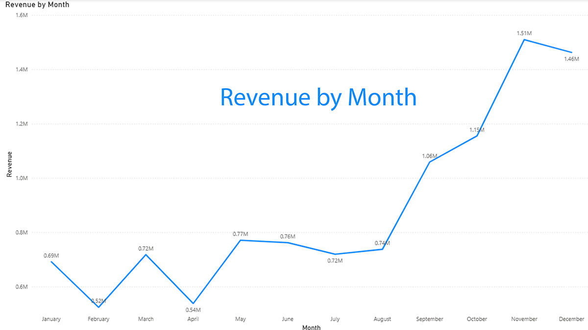

# TATA Business Retail Analytics

## 🌍 About TATA

TATA Group is a global company operating in more than 100 countries across six continents, with a mission to **'improve the quality of life of the communities we serve'**. This project is part of a job simulation organized by **TATA Insights and Quants (TATA IQ)**.

## 📌 Project Overview

This data analytics project focuses on answering critical business questions from executive leadership by leveraging data visualization and analytical insights. We uncover hidden stories within large datasets to support strategic decision-making for both the CEO and CMO.

## 🎯 Key Objectives

- Answer critical questions posed by the CMO and CEO
- Extract actionable insights from retail data using visualization solutions
- Create compelling data-driven narratives from complex datasets
- Support executive decision-making with KPI-focused analytics

## 💡 Core Skills Demonstrated

- 📊 **Data Visualization** - Creating compelling visual representations
- 🔍 **Data Analysis** - Extracting patterns and insights
- 📈 **Data Interpretation** - Translating data into business recommendations
- 📱 **Visual Basic** - Development and automation skills

## 📊 Key Performance Indicators (KPIs)

### 🎬 CEO Requirements

1. **Time Series Analysis (Year 2011)**
   - Analyze sales trends and performance metrics for 2011
   - Track monthly/quarterly patterns
   - Identify seasonal variations

2. **Regional Demand Analysis**
   - View product demand across regions
   - **Exclude United Kingdom** from regional analysis
   - Identify high-performing markets

### 📢 CMO Requirements

1. **Top 10 Revenue-Generating Countries**
   - Identify highest revenue-generating markets
   - Analyze both revenue and quantity sold metrics
   - Benchmark performance across regions

2. **Top Revenue-Generating Customers**
   - Identify key customer accounts
   - Analyze customer contribution to total revenue
   - Support customer relationship strategies

## 🛠️ Tools & Technologies

- **Primary Tool**: Power BI - For interactive dashboards and visualizations
- **Data Processing**: SQL for data transformation and aggregation
- **Analysis Support**: Excel for detailed calculations and data validation

## 📁 Project Deliverables

✅ Interactive Power BI dashboards for CEO KPIs
✅ Time series visualization for 2011 performance
✅ Regional demand analysis and comparison charts
✅ Top 10 countries revenue rankings with quantity metrics
✅ Customer revenue contribution analysis
✅ Executive summary reports and insights

## 📈 Data Visualization Approach

- **Interactive Dashboards**: Allow executives to explore data dynamically
- **Time Series Charts**: Track trends over specific periods
- **Geographic Maps**: Visualize regional performance
- **Customer Analytics**: Identify revenue drivers and opportunities
- **Comparative Analysis**: Benchmark performance across dimensions

## 🚀 Getting Started

### Prerequisites
- Power BI Desktop or Power BI Online
- Access to retail business data
- SQL database connectivity (if applicable)

### Key Insights to Explore
1. Navigate to the 2011 time series dashboard for year-specific analysis
2. Review regional demand patterns (excluding UK)
3. Analyze top revenue-generating countries
4. Identify key customer accounts driving revenue

## 📝 Documentation

- Dashboard guides for each executive stakeholder
- Data dictionary defining key metrics and dimensions
- Methodology documentation for analyses performed

## 🎓 Project Impact

This project demonstrates the ability to:
- Transform raw data into executive-ready insights
- Create actionable visualizations that drive business decisions
- Support C-level strategic planning with data analytics
- Deliver compelling data storytelling

---

**Project Type**: TATA IQ Job Simulation | **Last Updated**: June 2026
